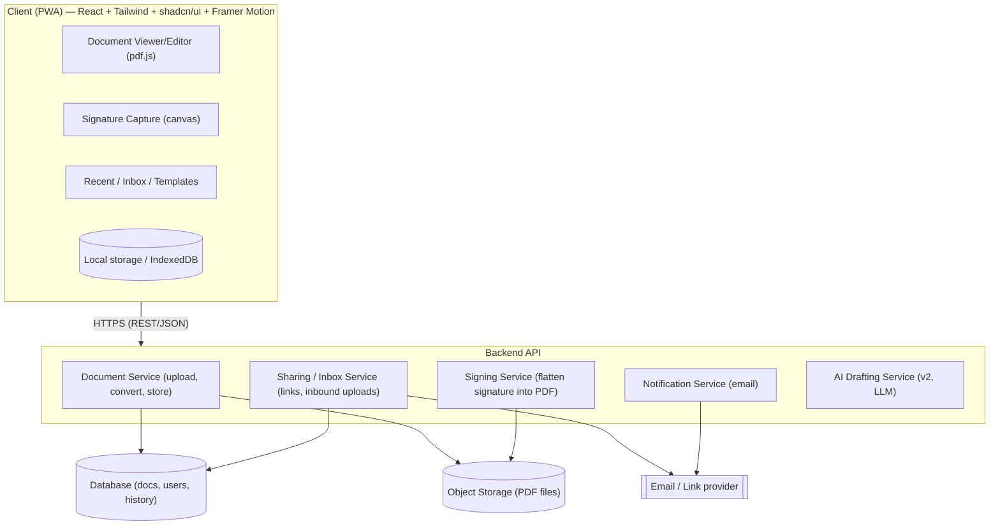
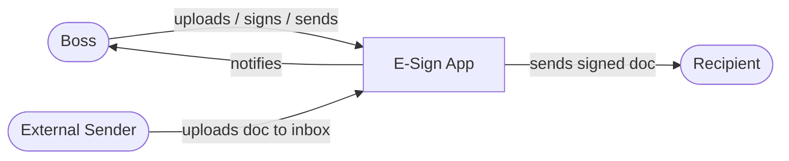
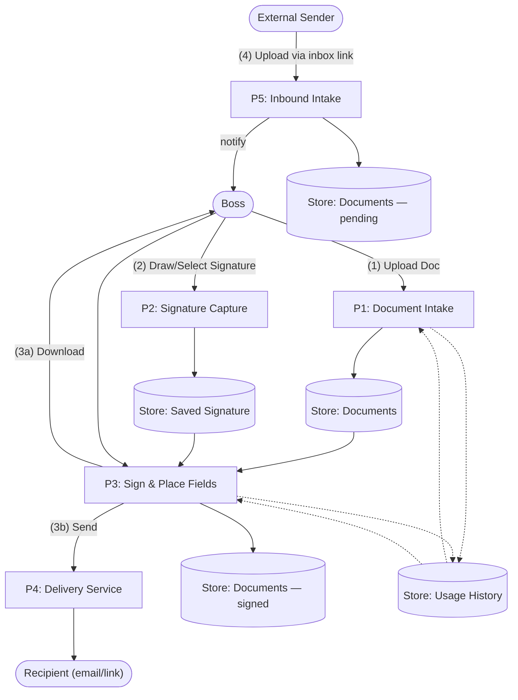
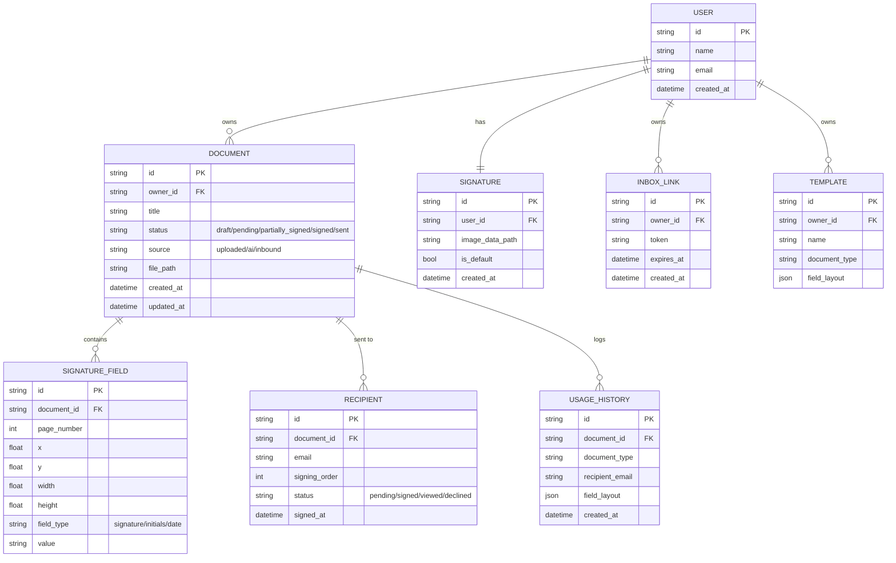

# E-Sign App — Project Plan

## 1. Overview
A simple, fast, personal e-signature web app: upload a document, sign it, download the signed PDF, and send it to others — or receive a document from someone else for signing. Built **web-first**, but designed **mobile/foldable-first** in layout since the primary user will mostly use a Samsung Galaxy Z Fold.

**Primary user:** One person (single-user tool — no full multi-user accounts in v1).

**Core loop (outbound):**
1. Upload a document (PDF, or image/DOCX converted to PDF) — or generate one with AI if he doesn't have one yet
2. Place a signature (and optionally initials/date) on the document
3. Download the signed PDF **and/or send it directly to the other party**

**Core loop (inbound):**
1. Someone else sends him a document to sign (via a shareable upload link/inbox — no login required for the sender)
2. It lands in his "to sign" queue
3. He signs it and sends it back / downloads it

## 2. Why it's more than "just an e-sig app"
- **Reusable signature** — draw/type/upload once, saved locally, reused every time (no re-signing from scratch)
- **Foldable-optimized UI** — cover screen shows pending/recent docs at a glance; unfolded screen is the full signing canvas
- **Installable as a PWA** — adds a home-screen icon, works offline, feels like a native app
- **Templates** — save signature/date field positions for document types he signs repeatedly
- **Batch signing** — sign multiple documents in one session without re-uploading one at a time
- **Recent documents list** — quick access without hunting through downloads
- **Audit stamp** — embeds a timestamp note in the PDF metadata as lightweight proof of signing
- **Multi-page thumbnail navigation** — jump straight to the signature page in long contracts
- **AI document drafting** — if he doesn't have a document yet, describe what he needs (e.g. "simple NDA for a contractor") and get a draft PDF generated to review, edit, and sign
- **Send to recipient** — deliver the signed document directly (email/link) instead of just downloading it
- **Receive documents for signing** — others can send *him* a document via a shareable link, no account needed on their end
- **Learns from usage** — over time, notices patterns in the documents he signs (recurring types, common signature/date placement, frequent recipients) and uses that to speed up future signing

## 3. Core Features (v1)
| Feature | Description |
|---|---|
| Upload document | PDF upload (image/DOCX-to-PDF conversion as stretch goal) |
| Signature capture | Draw (touch/mouse), type (styled font), or upload image |
| Signature reuse | Save default signature locally, reuse across documents |
| Placement | Drag-and-drop signature/initials/date, resizable |
| Multi-page support | Thumbnail sidebar/strip to navigate pages |
| Export | Download signed document as a flattened PDF |
| Send to recipient | Deliver signed PDF directly (email or shareable link) — not just download |
| Receive for signing | Shareable inbox link others can use to send him a document to sign, no login required for sender |
| Recent documents | List of recently signed/in-progress documents |
| Multi-signer tracking | A document can require signatures from more than one party; track who's signed, who hasn't, and notify each signer in turn |

## 4. Nice-to-Have Features (v2+)
- **Document memory / learning** — the app tracks what kinds of documents he signs over time (type, field placement, recipients) and uses that history to auto-suggest field positions, pre-fill likely recipients, or surface relevant templates — essentially getting faster/smarter the more he uses it
- **AI-assisted document generation** — describe the document needed in plain language, AI drafts a starting PDF (e.g. simple agreements, letters, forms) for him to review/edit before signing. Scope depends on what document types he actually needs — worth revisiting once that's clearer
- Templates with pre-placed fields for recurring document types
- Batch signing mode
- PWA install + offline support
- Audit trail / timestamp metadata embed
- Optional watermark or "signed copy" stamp
- Password-protect exported PDF
- Dark mode

**Explicitly out of scope for now:** full multi-user accounts/login for other people to use the whole app themselves. Other people only ever interact with it as senders/recipients of a single document, not as full users.

## 5. Design Priorities
- **Mobile/foldable-first layout**: optimize for Z Fold's narrow cover screen (quick glance/actions) and near-square unfolded screen (full editing canvas); should also work fine on any standard phone, tablet, or desktop browser
- **Minimal clicks**: signing a document he's signed before should take under 10 seconds
- **Local-first where possible**: signature and recent docs stay on-device; a lightweight backend is needed for sending/receiving documents
- **Touch-friendly**: large tap targets, easy drag-and-drop with a finger
- **Distinctive, premium visual design** — no generic "vibe-coded" look: not stock Lucide icons used as-is, not default unstyled shadcn components, no template-feeling layouts. Custom/refined iconography, a deliberate color palette and type system, and purposeful motion rather than default component transitions

## 6. Suggested Tech Stack
- **Frontend:** React + Tailwind (responsive, foldable-aware breakpoints)
- **UI components:** shadcn/ui as a base, customized (colors, spacing, states) rather than used out-of-the-box, so it doesn't read as a template
- **Motion:** Framer Motion for page transitions, drag-and-drop signature placement, and state changes (upload → sign → send), tuned to feel fluid and intentional rather than decorative
- **Iconography:** custom or heavily restyled icon set instead of default Lucide icons, to avoid the generic look
- **PDF handling:** `pdf-lib` or `pdf.js` for rendering + `pdf-lib` for flattening signatures into the PDF
- **Signature capture:** `signature_pad` (canvas-based drawing) or custom canvas component
- **Backend:** Lightweight API (Node/Express or serverless functions) for sending/receiving documents, generating shareable inbox links, and email delivery
- **Storage:** Local storage / IndexedDB on-device for saved signature + recent docs; backend database + object storage (e.g. S3-compatible) for documents in transit (sent/received) and usage history
- **AI drafting (v2):** LLM API call to generate a draft document from a plain-language description, converted to PDF for editing
- **PWA:** Service worker + manifest for installability and offline use

## 7. Answered / Open Questions
- [x] **Document types:** Mixed — both business and personal documents. No single vertical to optimize for, so field placement/templates need to stay flexible and general-purpose rather than tailored to one document type.
- [x] **Inbox link behavior:** Unique link generated per request (not one permanent shared link) — each request gets its own token, so access can be scoped and expired per document rather than left open-ended.
- [x] **Multi-signer:** Preferred — documents often need more than just his signature, so multi-signer tracking (who's signed, who hasn't, in what order) is a real v1 requirement, not a "later" feature.

## 8. Suggested Build Order
1. Upload + view PDF
2. Draw/save signature, place on page, export signed PDF
3. Mobile/foldable responsive polish
4. Send to recipient (outbound)
5. Receive documents (inbound link/inbox)
6. Multi-signer flow (tracking + sequencing across signers)
7. Recent documents list
8. Templates
9. PWA install + offline support
10. Batch signing

## 9. System Architecture



## 10. Data Flow Diagram (DFD)

**Level 0 (context):**



**Level 1 (major processes):**



## 11. Entity Relationship Diagram (ERD)



## 12. User Stories

**Signing (outbound)**
- As the primary user, I want to upload a PDF so that I can sign it.
- As the primary user, I want to draw/type/upload my signature once and reuse it, so I don't redraw it every time.
- As the primary user, I want to drag my signature onto the exact spot on the page, so it looks correct on the final document.
- As the primary user, I want to download the signed PDF, so I have a copy for my records.
- As the primary user, I want to send the signed PDF directly to someone's email, so I don't have to leave the app to send it.
- As the primary user, I want to add multiple signers to a document and set the signing order, so multi-party documents get routed correctly.
- As the primary user, I want to see the status of each signer (pending/signed/declined), so I know who's holding up a document.

**Receiving (inbound)**
- As the primary user, I want a unique link generated for each signing request, so access can be scoped and expired per document rather than shared indefinitely.
- As an external sender, I want to upload a document via a link without creating an account, so I can quickly get something signed.
- As the primary user, I want to see incoming documents in a "to sign" queue, so I know what's waiting on me.
- As a signer other than the primary user, I want to be notified when it's my turn to sign in a multi-signer document, so I don't have to check manually.

**Efficiency / personalization**
- As the primary user, I want the app to remember common document types and field placements, so signing gets faster over time.
- As the primary user, I want to save a template for a document type I sign often, so fields are pre-placed next time.
- As the primary user, I want to sign multiple documents in one session (batch), so I don't repeat the same steps for each one.
- As the primary user, I want to generate a simple document with AI if I don't have one yet, so I don't need a separate tool.

**Mobile/foldable**
- As the primary user, I want to glance at pending documents from my cover screen, so I can triage quickly without unfolding my phone.
- As the primary user, I want the full signing experience on the unfolded screen, so I have enough space to place things precisely.
- As the primary user, I want to install the app to my home screen, so it feels like a native app and works offline.

## 13. Project Architecture (Folder/File Structure)

```
esign-app/
├── apps/
│   ├── web/                        # Frontend (React + Vite/Next)
│   │   ├── public/
│   │   │   ├── manifest.json       # PWA manifest
│   │   │   └── icons/              # Custom app icons (not default Lucide set)
│   │   ├── src/
│   │   │   ├── app/                # Routes/pages
│   │   │   │   ├── home/
│   │   │   │   ├── inbox/          # Incoming documents queue
│   │   │   │   ├── sign/[docId]/   # Signing/editor view
│   │   │   │   ├── templates/
│   │   │   │   └── settings/
│   │   │   ├── components/
│   │   │   │   ├── ui/             # shadcn/ui base components, customized
│   │   │   │   ├── document/       # PDF viewer, page thumbnails
│   │   │   │   ├── signature/      # Signature pad, saved signature picker
│   │   │   │   └── motion/         # Shared Framer Motion variants/transitions
│   │   │   ├── hooks/
│   │   │   ├── lib/
│   │   │   │   ├── pdf.ts          # pdf.js / pdf-lib helpers
│   │   │   │   ├── storage.ts      # IndexedDB / local storage helpers
│   │   │   │   └── api.ts          # API client
│   │   │   ├── styles/
│   │   │   │   └── theme.css       # Custom color palette, type system
│   │   │   └── main.tsx
│   │   └── package.json
│   │
│   └── api/                        # Backend
│       ├── src/
│       │   ├── routes/
│       │   │   ├── documents.ts
│       │   │   ├── signatures.ts
│       │   │   ├── inbox.ts        # Inbound link + upload handling
│       │   │   ├── delivery.ts     # Send signed doc to recipient
│       │   │   └── ai-draft.ts     # v2: AI document generation
│       │   ├── services/
│       │   │   ├── documentService.ts
│       │   │   ├── signingService.ts   # Flatten signature into PDF
│       │   │   ├── sharingService.ts   # Generate/validate inbox links
│       │   │   ├── notificationService.ts  # Email sending
│       │   │   └── historyService.ts   # Usage history + suggestions
│       │   ├── models/             # DB models (User, Document, SignatureField, Recipient, Template, InboxLink, UsageHistory)
│       │   ├── storage/            # Object storage client (PDF files)
│       │   └── server.ts
│       └── package.json
│
├── packages/
│   └── shared/                     # Shared types/constants between web + api
│       └── types.ts
│
├── esign-app-plan.md                # This plan
└── README.md
```
