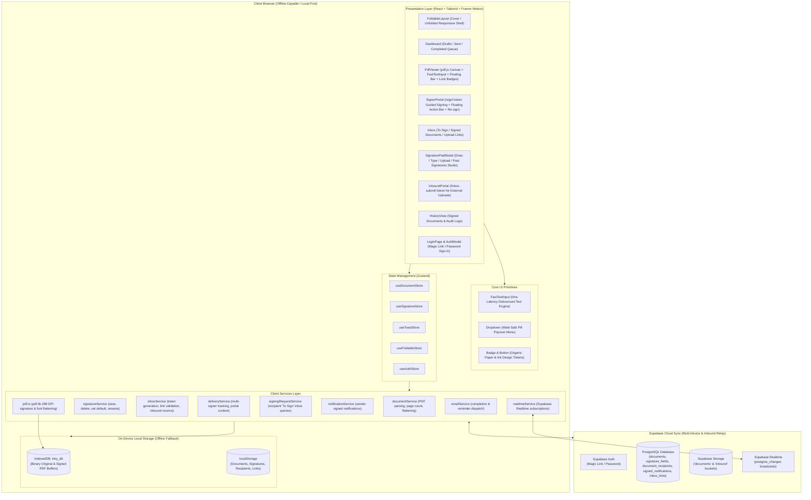
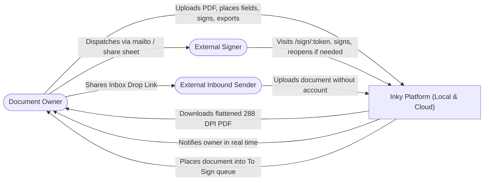
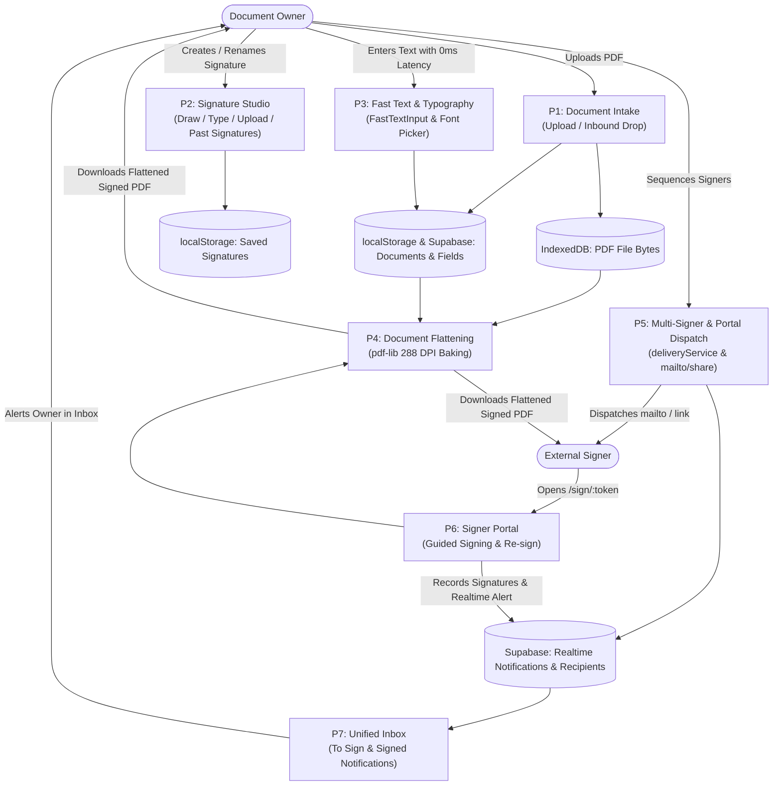
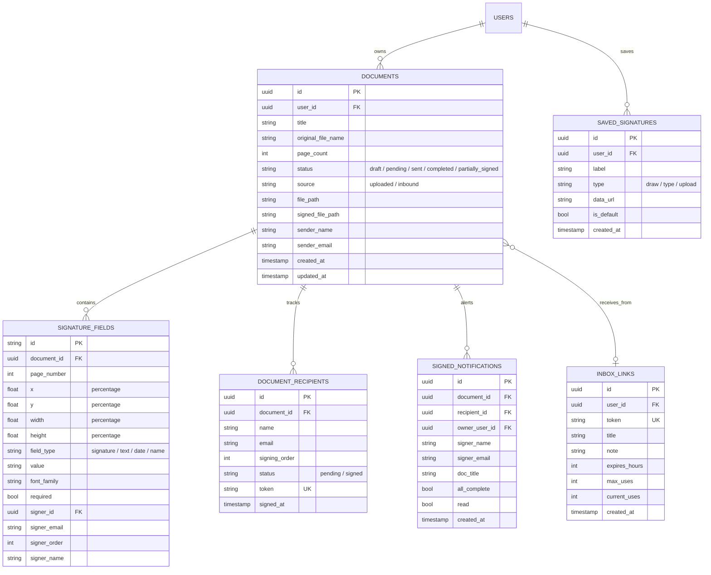

# Inky — Technical Architecture & Project Specification

## 1. Overview
**Inky** is a fast, elegant, privacy-first personal e-signature and multi-signer web platform built around an organic "wabi-sabi paper" aesthetic. It enables users to upload documents, place signatures/text/dates, download flattened print-ready PDFs, sequence multi-party signers, manage incoming and outgoing inboxes, and receive inbound documents from external parties via scoped shareable links.

Built **client-side and offline-capable**, Inky operates out of the box using `IndexedDB` for PDF binary file storage and `localStorage` for document metadata, signature profiles, and inbound links. When connected to **Supabase**, it unlocks seamless multi-device synchronization, PostgreSQL Row Level Security (RLS), Supabase Storage, and Realtime reactive notifications.

Inky is engineered **mobile/foldable-first** to feel exceptional on devices like the Samsung Galaxy Z Fold (folded cover screen for triage and queue navigation, unfolded canvas for signing and field placement), while providing a premium desktop and tablet workstation experience.

**Primary User & External Collaborators:**
- **Document Owner**: Single-user personal and professional workflows (upload, sequence signers, track status, view audit logs, manage saved signatures).
- **External Signers**: Zero-login public signer portal (`/sign/:token`) with guided signing navigation, live field customization, and "Edit / Re-sign" capabilities.
- **External Inbound Senders**: Accountless drop-box portal (`/inbox-submit/:token`) allowing clients or partners to submit PDFs directly into the owner's queue.

---

## 2. Key Product Highlights

- **100% Local-First & Offline-Capable** — PDF binary files stay safely on-device in IndexedDB (`inky_db`); signatures, metadata, and links persist in `localStorage`. Zero reliance on a backend server for core signing.
- **High-Resolution 288 DPI PDF Flattening** — Client-side vector PDF generation via `pdf-lib` merges signatures, custom typography, stamps, and dates directly into downloadable PDF bytes in the browser.
- **0ms Latency Text Engine (`FastTextInput`)** — Dedicated high-performance text input component with local React state, 150ms debounced storage persistence, focus auto-selection, and mouse event isolation for fluid 60+ FPS text entry without keystroke lag or dropped letters.
- **Zero-Cost ($0.00) Multi-Signer Dispatch** — Direct `mailto:` dispatcher pre-filled with recipient details, native device share sheet (`navigator.share`) for WhatsApp/Telegram/Slack/Signal, and 1-click clipboard copy.
- **Zero-Login Public Signer Portal (`/sign/:token`)** — External signers review, edit, and sign assigned fields with a sticky floating action bar, font customization toolbar, and full Edit / Re-sign support.
- **Unified Inbox (Incoming & Outgoing)** — Integrated tab featuring:
  - **"To Sign"**: Documents sent directly to your email address with 1-click "Sign Now" or "View" and permanent delete controls.
  - **"Signed Documents"**: Real-time notifications for senders when recipients complete signatures, with mark-read, mark-all-read, and deletion options.
  - **"Upload Links"**: Manage public inbound PDF drop links with expiration and usage limits.
- **Reusable Signature Studio & Past Signatures** — Draw (canvas smoothing), Type (14+ curated fonts), or Upload (transparent PNG filtering). Rename signatures inline, select defaults, and use 1-tap "Stamp My Sig".
- **Professional Document Typography** — Full support for formal document fonts (**Inter**, **Geist**, **Arial**, **Times New Roman**, **EB Garamond**) and expressive scripts (**Dancing Script**, **Caveat**, etc.) with matching embedded vector fonts in `pdf-lib`.
- **Tamper-Resistant Field Sealing & Isolation** — Completed recipient signatures are automatically locked and badged (`Lock` / `ShieldCheck`) to prevent tampering. Strict session isolation guarantees signatures never bleed across documents or signers.
- **Foldable & Mobile-Optimized** — Custom non-scrollable adaptive segmented tabs, compact cover-screen layout (~280px–344px), and spacious unfolded canvas.
- **Wabi-Sabi Paper & Ink Design** — Warm paper surfaces (`#FDFCF8`), deep loam typography (`#2C2C24`), earthy moss accents (`#5D7052`), terracotta (`#C18C5D`), ochre (`#D99E4B`), slate (`#4E5F70`), glassmorphic panels, and custom organic pill dropdown menus.
- **Supabase Realtime Sync** — Reactive live updates across devices powered by `realtimeService` listening to PostgreSQL `postgres_changes`.

---

## 3. Core Features Matrix

| Feature Area | Capability | Status |
|---|---|---|
| **Document Upload & View** | Multi-page PDF upload, canvas rendering via `pdfjs-dist`, zoom controls, and thumbnail strip | Complete |
| **0ms Text Engine** | `FastTextInput` with local state, debounced store updates, and focus auto-selection | Complete |
| **Signature Studio** | Draw (smooth canvas), Type (14+ fonts), or Upload image with auto-transparency | Complete |
| **Past Signatures & Quick-Sign**| "Past Signatures" tab, default signature selection, inline renaming, and 1-tap "Stamp My Sig" | Complete |
| **Field Placement** | Drag-and-drop, resize corner handle, and positioning for Signatures, Text, Dates, and Names | Complete |
| **Typography Customization** | Floating context toolbar with Inter, Geist, Arial, Times New Roman, EB Garamond, Dancing Script, Caveat | Complete |
| **Client-Side Flattening** | Browser-side 288 DPI PDF baking via `pdf-lib` embedding vector text, dates, and signature images | Complete |
| **Zero-Login Signer Portal** | `/sign/:token` route with floating sticky bottom bar (`+ Signature Field`, `Stamp My Sig`, `+ Date`, `+ Text`) | Complete |
| **Edit & Re-sign Workflow** | Allows recipients to reopen completed documents to make corrections or adjust placement | Complete |
| **Unified Inbox ("To Sign")** | Displays documents waiting for your signature with direct 1-click signing & deletion | Complete |
| **Unified Inbox ("Signed Docs")**| Live sender alerts when recipients complete signing, with mark-read and deletion actions | Complete |
| **Inbound Drop Portal** | Public `/inbox-submit/:token` route for receiving PDFs with expiration & usage limits | Complete |
| **Document Queue Filters** | Segmented filters (**Drafts**, **Sent**, **Completed**) with time beside date display | Complete |
| **Multi-Signer Sequencing** | Sequential (Signer 1, 2, etc.) or parallel signing order with terracotta, moss, ochre, slate tags | Complete |
| **Field Locking & Sealing** | Signed recipient fields are permanently locked against accidental moving or tampering | Complete |
| **Zero-Cost Sharing** | Pre-filled `mailto:` trigger, native device share sheet (`navigator.share`), and 1-click link copy | Complete |
| **Foldable Responsiveness** | Tailored for Samsung Galaxy Z Fold cover and unfolded screens without clipping or horizontal overflow | Complete |
| **Supabase Realtime Sync** | Multi-device synchronization, RLS security isolation, and Realtime reactive alerts | Complete |

---

## 4. Technology Stack

- **Core & Build:** React 18, TypeScript 5.4, Vite 5.4
- **Styling:** Vanilla Tailwind CSS + Custom CSS Design System ([src/styles/theme.css](file:///c:/Users/james/Downloads/Inky-main/src/styles/theme.css))
- **Typography:** Google Fonts (`Philosopher`, `Inter`, `Geist`, `EB Garamond`, `Dancing Script`, `Caveat`, `Alex Brush`, etc.)
- **Motion & Micro-interactions:** Framer Motion
- **Iconography:** Lucide React
- **PDF Rendering:** `pdfjs-dist` (client-side PDF canvas rendering and page inspection)
- **PDF Generation & Embedding:** `pdf-lib` (client-side PDF byte manipulation, signature stamping, 288 DPI font embedding)
- **Signature Capture:** `signature_pad` + custom canvas smoothing and transparency filtering
- **State Management:** Zustand (`useDocumentStore`, `useSignatureStore`, `useToastStore`, `useFoldableStore`, `useAuthStore`)
- **Backend & Cloud Sync (Supabase):**
  - **Auth**: Email Magic Link & Password authentication with full LoginPage and modals.
  - **Database (PostgreSQL)**: Documents, signature fields, document recipients, signed notifications, inbox links, and saved signatures with Row Level Security (RLS).
  - **Realtime**: PostgreSQL `postgres_changes` listeners via `realtimeService`.
  - **Storage**: Encrypted storage buckets for owner documents (`documents`) and accountless external uploads (`inbound`).
- **Local Storage (Offline-First):**
  - **IndexedDB (`inky_db`)**: Stores binary PDF buffers (original and signed PDFs).
  - **`localStorage`**: Stores document metadata, saved signatures, inbound tokens, and app settings.

---

## 5. System Architecture



---

## 6. Data Flow Diagrams (DFD)

### Level 0 — System Context


### Level 1 — Core Operational Workflows


---

## 7. Entity Relationship Model (Database Schema)



---

## 8. Actual Project Codebase Structure

```
Inky/
├── index.html                      # HTML root with curated Google Fonts
├── package.json                    # React 18, Vite, pdf-lib, pdfjs-dist, lucide-react
├── vite.config.ts                  # Vite build configuration with path aliases
├── tailwind.config.js              # Tailwind custom wabi-sabi paper colors & typography tokens
├── esign-app-plan.md               # Technical architecture and project specification
├── README.md                       # Comprehensive user guide and overview
│
├── src/
│   ├── main.tsx                    # React DOM entry point
│   ├── App.tsx                     # Top-level coordinator, tab router & modal orchestrator
│   ├── types.ts                    # Shared domain interfaces (Document, SignatureField, Recipient, etc.)
│   ├── utils.ts                    # Canvas trimming, blob downloads, date & time formatters
│   │
│   ├── components/
│   │   ├── FoldableLayout.tsx      # Responsive header, desktop sidebar, mobile bottom nav
│   │   ├── Dashboard.tsx           # Document queue with Drafts / Sent / Completed filters & search
│   │   ├── PdfViewer.tsx           # PDF canvas, floating toolbar, font selector & field assignment
│   │   ├── SignerPortal.tsx        # Public zero-login recipient signing portal (/sign/:token)
│   │   ├── SignerAuthGate.tsx      # Recipient email/token validation gate
│   │   ├── HistoryView.tsx         # Completed documents, on-the-fly flattening & audit logs
│   │   ├── InboundPortal.tsx       # Public portal route for external uploads (/inbox-submit/:token)
│   │   ├── LoginPage.tsx           # Full-page email/password and magic link authentication
│   │   ├── MultiSignerPanel.tsx    # Multi-party signing sequencing, mailto & device share sheet
│   │   ├── ErrorBoundary.tsx       # Global React crash protection
│   │   ├── Toast.tsx               # Theme-matched notifications
│   │   │
│   │   ├── ui/
│   │   │   ├── Badge.tsx           # Organic badges
│   │   │   ├── Button.tsx          # Wabi-sabi buttons
│   │   │   ├── Card.tsx            # Paper cards
│   │   │   ├── Dropdown.tsx        # Organic pill trigger & grouped typography menu
│   │   │   └── FastTextInput.tsx   # 0ms latency debounced text input component
│   │   │
│   │   └── modals/
│   │       ├── SignaturePadModal.tsx # Draw/Type/Upload/Past Signatures studio with naming inputs
│   │       ├── ShareInboxModal.tsx   # Inbound drop link generator modal
│   │       ├── ConfirmModal.tsx      # Wabi-sabi deletion & reset confirmation dialogs
│   │       └── AuthModal.tsx         # Quick auth popup modal
│   │
│   ├── lib/
│   │   ├── pdf.ts                  # 288 DPI PDF flattening, font embedding & signature stamping
│   │   ├── storage.ts              # IndexedDB binary PDF store & localStorage management
│   │   └── supabase.ts             # Supabase client with graceful offline fallback
│   │
│   ├── services/
│   │   ├── deliveryService.ts      # Multi-signer links, mailto dispatch & portal context
│   │   ├── documentService.ts      # Document CRUD, cloud storage sync & PDF flattening
│   │   ├── emailService.ts         # Automated completion & reminder dispatch
│   │   ├── inboxService.ts         # Inbound links & external submission handling
│   │   ├── notificationService.ts  # Sender inbox signed document notifications
│   │   ├── realtimeService.ts      # Supabase Realtime postgres_changes listeners
│   │   ├── signatureService.ts     # Saved signatures management & default toggling
│   │   └── signingRequestService.ts # Recipient "To Sign" inbox queries & deletion
│   │
│   ├── store/
│   │   ├── useDocumentStore.ts     # Active documents, fields state & signing actions
│   │   ├── useSignatureStore.ts    # Saved signatures list, defaults & renaming
│   │   ├── useToastStore.ts        # Global notification toast messages
│   │   ├── useFoldableStore.ts     # Viewport tracking for foldable/responsive layouts
│   │   └── useAuthStore.ts         # Supabase authentication session & user profile store
│   │
│   └── styles/
│       └── theme.css               # Design system: paper colors, moss buttons, badges, scrollbars
│
└── supabase/
    ├── schema.sql                  # Base PostgreSQL schema, RLS policies & storage buckets
    ├── migration_complete_signing_workflow.sql # End-to-end multi-signer sequencing
    ├── migration_realtime.sql      # Supabase Realtime publications
    ├── migration_security_isolation.sql # Field locking & security isolation
    ├── migration_signed_notifications.sql # Signed notifications inbox table & triggers
    ├── migration_signer_access.sql # Recipient token validation access rules
    ├── migration_allow_authenticated_signers.sql # Authenticated signer rules
    ├── migration_fix_rls_recursion.sql # Infinite RLS recursion resolution
    └── migration_inbox_delete.sql  # Permanent deletion support
```

---

## 9. Verification & Quality Standards

1. **Build & Type Integrity**: Clean compilation with `npm run build` (`tsc && vite build`) with zero TypeScript errors or warnings.
2. **Offline-First Resilience**: Full signing, editing, and flattening workflow operates flawlessly even with network disconnected.
3. **Cross-Browser Font Embedding**: Vector-crisp PDF output matching on-screen typography across Inter, Geist, Arial, Times New Roman, EB Garamond, Dancing Script, and Caveat.
4. **Security & Sealing**: Locked recipient fields prevent tampering post-signing. Strict Row Level Security prevents cross-account document leaks.
