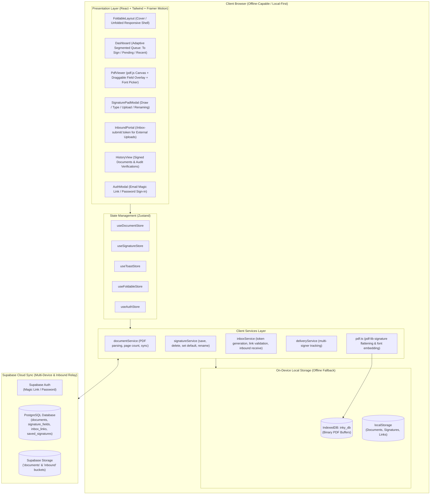
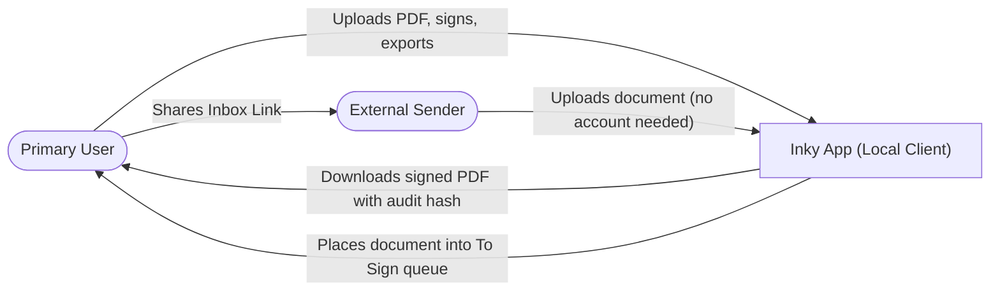
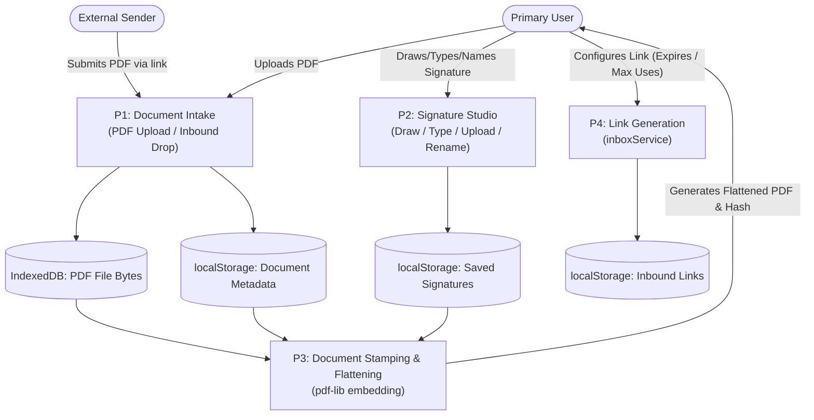
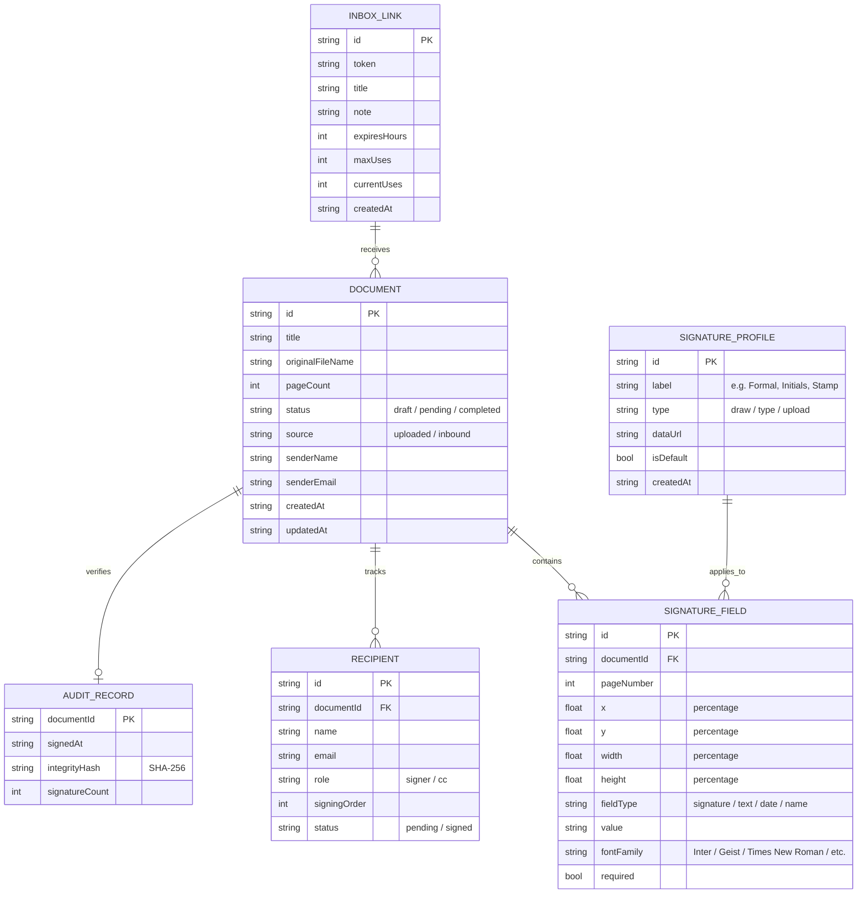

# Inky — Project Plan (Client-Side Local E-Signature App)

## 1. Overview
**Inky** is a fast, elegant, privacy-first personal e-signature web app built around an organic "wabi-sabi paper" aesthetic. It enables users to upload documents, place signatures/text/dates, download flattened PDFs, manage multi-signer workflows, and receive inbound documents from external parties via scoped shareable links.

Built **100% client-side** (no external backend server required), Inky runs entirely within the browser using IndexedDB for PDF file storage and `localStorage` for document metadata, signature profiles, and inbound links. It is designed **mobile/foldable-first** to feel exceptional on devices like the Samsung Galaxy Z Fold (folded cover screen for queue triage, unfolded canvas for signing), while being fully responsive on standard smartphones, tablets, and desktop browsers.

**Primary user:** One person (single-user personal tool — external parties interact solely through scoped shareable links without requiring accounts).

**Core loop (outbound):**
1. Upload a PDF document.
2. Place and resize signatures, text, dates, or initials with customizable professional or handwriting fonts.
3. Export a flattened signed PDF and/or dispatch to multi-party signers.

**Core loop (inbound):**
1. Generate an **Inbox Link** with optional expiration and submission limits.
2. External sender uploads a document via the inbound portal (no login required).
3. Document lands in the user's "To Sign" queue for review and signing.

---

## 2. Key Product Highlights
- **100% Local & Offline-First** — PDF binary files stay safely on-device in IndexedDB (`inky_db`); signatures, metadata, and links persist in `localStorage`. Zero reliance on a backend server.
- **Reusable & Renamable Signatures** — Draw (pen canvas), Type (script/clean typography), or Upload (transparent PNG filtering). Rename signatures (e.g. "Formal", "Initials") and toggle a default signature for one-tap placement.
- **Foldable & Mobile-Optimized** — Custom non-scrollable adaptive segmented tabs, compact cover-screen layout, and spacious unfolded canvas.
- **Professional Document Typography** — Full support for formal document fonts (**Inter**, **Geist**, **Arial**, **Times New Roman**, **EB Garamond**) and expressive scripts (**Dancing Script**, **Caveat**, etc.) with matching embedded vector fonts in `pdf-lib`.
- **Wabi-Sabi Paper & Ink Design** — Warm paper surfaces (`#FDFCF8`), deep loam typography (`#2C2C24`), earthy moss accents (`#5D7052`), glassmorphic panels, and custom organic pill dropdown menus (no browser OS `<select>` controls).
- **Audit Verification & History** — Exported PDFs receive embedded timestamp metadata and SHA-256 cryptographic verification hashes viewable in Document History.
- **Shareable Inbound Portal** — Create shareable links (`/inbox-submit/:token`) allowing external collaborators to upload documents directly into your queue without accounts.
- **Multi-Signer Tracking** — Define signing order and recipient parties with status monitoring (Pending / Signed).

---

## 3. Core Features Matrix

| Feature | Description | Status |
|---|---|---|
| **Document Upload & View** | PDF upload with multi-page navigation, zoom, and thumbnail strip via `pdf.js` | Complete |
| **Signature Studio** | Draw (touch/mouse), Type (custom typography), or Upload image with auto-transparency | Complete |
| **Signature Management** | Inline renaming, label editing, default signature selection, and quick toolbar picker | Complete |
| **Field Placement** | Drag-and-drop, resize, and positioning for Signatures, Text, Dates, and Names | Complete |
| **Professional Typography** | Inter, Geist, Arial, Times New Roman, and EB Garamond with dynamic PDF font embedding | Complete |
| **Client-Side Flattening** | `pdf-lib` merges signatures, text, and dates into a downloadable vector PDF in the browser | Complete |
| **Custom Dropdown Menus** | Organic pill-style popover menus with grouped categories and typography previews | Complete |
| **Foldable Responsiveness** | Adaptive non-scrollable segmented controls (`To Sign`, `Pending`, `Recent`) optimized for Z Fold | Complete |
| **Inbound Drop Portal** | Scoped shareable upload links with configurable expiration and submission limits | Complete |
| **Document History & Audit** | Audit log tracking signed documents, timestamps, and SHA-256 verification | Complete |
| **Multi-Signer Workflow** | Multi-party assignment modal for sequencing signers and tracking completion | Complete |

---

## 4. Design Priorities
- **Mobile/Foldable-First Layout**: Tested and refined for Samsung Galaxy Z Fold's narrow cover screen (~280px–344px) and expanded tablet view. Zero horizontal overflow or scrollbar glitches.
- **Minimal Clicks**: Signing a document with a saved default signature takes under 10 seconds.
- **Organic Wabi-Sabi Aesthetic**: Cohesive paper and ink palette, custom pill controls, subtle wabi-sabi noise textures, and gentle Framer Motion transitions. No unstyled browser elements.
- **Touch-Friendly Targets**: Generous tap targets, draggable handles, and smooth pinch/zoom controls.

---

## 5. Technology Stack

- **Core & Build:** React 18, TypeScript, Vite
- **Styling:** Vanilla Tailwind CSS + Custom CSS Design System ([src/styles/theme.css](file:///c:/Users/Admin/Documents/Apps%20by%20Uno/Inky/src/styles/theme.css))
- **Typography:** Google Fonts (`Philosopher`, `Inter`, `Geist`, `EB Garamond`, `Dancing Script`, `Caveat`, etc.)
- **Motion & Micro-interactions:** Framer Motion
- **Iconography:** Lucide React (refined and styled within organic badge containers)
- **PDF Rendering:** `pdfjs-dist` (client-side PDF canvas rendering and page inspection)
- **PDF Generation & Embedding:** `pdf-lib` (client-side PDF byte manipulation, signature stamping, font embedding)
- **Signature Capture:** `signature_pad` + custom canvas smoothing and transparency filtering
- **State Management:** Zustand (`useDocumentStore`, `useSignatureStore`, `useToastStore`, `useFoldableStore`, `useAuthStore`)
- **Backend & Cloud Sync (Supabase):**
  - **Auth**: Email Magic Link & Password authentication for the document owner.
  - **Database (PostgreSQL)**: Documents, signature fields, saved signatures, and scoped inbox links with Row Level Security (RLS).
  - **Storage**: Encrypted storage buckets for owner documents (`documents`) and accountless external uploads (`inbound`).
- **Local Storage (Offline Fallback):**
  - **IndexedDB (`inky_db`)**: Stores binary PDF buffers (original and signed PDFs).
  - **`localStorage`**: Stores document metadata, saved signatures, inbound tokens, and app settings.

---

## 6. System Architecture



---

## 7. Data Flow Diagram (DFD)

### Level 0 — Context


### Level 1 — Major Local Processes


---

## 8. Entity Relationship Model (Local Schema)



---

## 9. User Stories & Acceptance Criteria

### Signing (Outbound)
- **Upload PDF**: As a user, I want to drag and drop or browse for a PDF document so I can begin signing immediately.
- **Custom Signature Naming**: As a user, I want to give names to my signatures (e.g. "My Formal Signature") and rename them inline anytime from the Saved Signatures screen.
- **Font Styling**: As a user, I want to select professional fonts (Inter, Geist, Times New Roman, Arial, EB Garamond) for typed signatures and text fields so my document looks authoritative.
- **Field Placement**: As a user, I want to place signatures, text, dates, and initials freely on any page with draggable and resizable handles.
- **Download Flattened PDF**: As a user, I want to export a finalized PDF where signatures and text are permanently embedded and can be opened in any PDF viewer.

### Inbound (Receiving)
- **Generate Inbox Link**: As a user, I want to create a shareable link with optional expiration (24h to 30d) and submission limits so external senders can drop documents to me.
- **Accountless External Upload**: As an external sender, I want to open an inbound link on my mobile phone or desktop and upload a PDF without signing up for an account.
- **Queue Notification**: As a user, I want inbound files to land directly in my "To Sign" queue tagged with an "Inbound" badge.

### Device & Mobile Experience
- **Foldable Screen Support**: As a Samsung Galaxy Z Fold user, I want the queue tabs (`To Sign`, `Pending`, `Recent`) to fit cleanly without horizontal scrolling on my narrow cover screen, and expand gracefully when unfolded.
- **Custom Dropdowns**: As a user, I want dropdowns to match Inky's paper and moss theme rather than opening raw browser/OS blue selection boxes.

---

## 10. Actual Project Codebase Structure

```
Inky/
├── index.html                      # HTML root, Google Fonts (Philosopher, Inter, Geist, Garamond, scripts)
├── package.json                    # Client dependencies (React, Vite, pdf-lib, pdfjs-dist, lucide-react)
├── vite.config.ts                  # Vite build config with path aliases (@/)
├── tailwind.config.js              # Tailwind custom colors & typography tokens
├── esign-app-plan.md               # Architecture and project plan
│
└── src/
    ├── main.tsx                    # App entry point
    ├── App.tsx                     # Top-level coordinator, tab router, modal orchestration
    ├── types.ts                    # Shared TypeScript interfaces (Document, SignatureField, InboxLink, etc.)
    ├── utils.ts                    # Canvas trimming, blob downloads, file helpers
    │
    ├── components/
    │   ├── FoldableLayout.tsx      # Responsive header, desktop sidebar, mobile bottom nav, ambient blobs
    │   ├── Dashboard.tsx           # Document queue, search, non-scrollable segmented tabs (To Sign/Pending/Recent)
    │   ├── PdfViewer.tsx           # PDF canvas renderer, toolbar, font picker, field overlay, export
    │   ├── HistoryView.tsx         # Exported signed documents, timestamps, and audit verification
    │   ├── InboundPortal.tsx       # Public portal route for external document upload (/inbox-submit/:token)
    │   ├── MultiSignerPanel.tsx    # Multi-party signing assignment and tracking modal
    │   ├── Toast.tsx               # Custom floating notification toasts
    │   │
    │   ├── ui/
    │   │   └── Dropdown.tsx        # Organic pill trigger, Framer Motion menu, grouped typography previews
    │   │
    │   └── modals/
    │       ├── SignaturePadModal.tsx # Draw/Type/Upload/Saved signature studio with naming inputs
    │       ├── ShareInboxModal.tsx   # Custom dropdown-powered inbound link generator
    │       ├── ConfirmModal.tsx      # Wabi-sabi confirmation dialog (no native browser alerts)
    │       └── AuthModal.tsx         # Supabase cloud sync sign-in / magic link modal
    │
    ├── lib/
    │   ├── pdf.ts                  # pdf-lib flattening, standard PDF font embedding, client-side signature stamp
    │   ├── storage.ts              # IndexedDB binary store (pdf_files) & localStorage metadata store
    │   └── supabase.ts             # Supabase client initialization with graceful fallback
    │
    ├── services/
    │   ├── documentService.ts      # Document upload, page inspection, canvas URL generation, signed download
    │   ├── signatureService.ts     # CRUD for signatures, default toggling, inline renaming
    │   ├── inboxService.ts         # Inbound link creation, validation, and submission processing
    │   └── deliveryService.ts      # Multi-signer workflow management
    │
    ├── store/
    │   ├── useDocumentStore.ts     # Document list, active document, signing state
    │   ├── useSignatureStore.ts    # Saved signatures list, default signature, rename action
    │   ├── useToastStore.ts        # Global toast notifications
    │   ├── useFoldableStore.ts     # Viewport tracking for foldable/responsive layouts
    │   └── useAuthStore.ts         # Supabase authentication session & user profile store
    │
    └── styles/
        └── theme.css               # Design system: paper colors, moss buttons, badges, scrollbars, animations
├── supabase/
│   └── schema.sql                  # PostgreSQL tables, RLS policies, storage bucket rules
└── .env.example                    # Supabase URL & Anon Key example configuration
```
